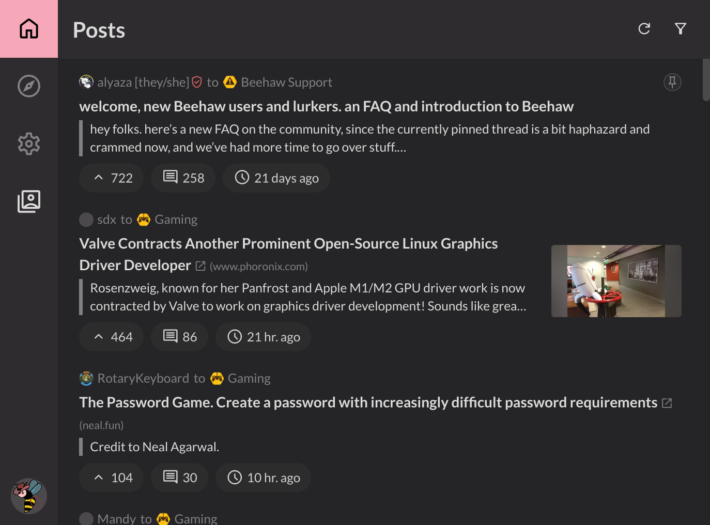

# Slemmy

[](https://slemmy.libdb.so)
[](https://app.netlify.com/sites/venerable-narwhal-87bb65/deploys)

<div align="center">
  <p>Cute Lemmy web app written in Svelte</p>
  
</div>

## **Hey!!**

**Please upvote these issues on the Lemmy repo!**

- [#3109: CORS support for external web clients?](https://github.com/LemmyNet/lemmy/issues/3109)
- [#3301: Allow cross-origin requests](https://github.com/LemmyNet/lemmy/pull/3301)

Without these issues being resolved, Slemmy **will not work** with Lemmy v0.18+!
If you want to use Slemmy, show your support for these issues!

> **Note**: A workaround that I can potentially implement is to use a proxy
> server to bypass CORS. This is what other web clients do. However, it has
> numerous security implications and would require maintenance on my part.
> This is a Lemmy issue, so please upvote the issues above!

## Features

- [x] WS support
- [x] Multiple instances (profiles support)
- [x] Posts feed
  - [x] Autoload on scroll
  - [x] Filtering and sorting
- [x] Comments feed
  - [ ] Autoload on scroll
  - [x] Filtering and sorting
- [x] Logging in
  - [x] Upvoting
  - [x] Commenting

## Rants

### Why Tailwind?

No good reason. Initially I wanted to try out a seemingly-good CSS framework.
It turned out to be awful, and so did Tailwind.

My advice? Never use Tailwind. It's a waste of time.

## Misc

### Favicon License

The favicon is taken from [OpenMoji](https://openmoji.org/), which is licensed
under the [CC BY-SA 4.0](https://creativecommons.org/licenses/by-sa/4.0/). It
is color-altered to be pink.

### Libraries

See [package.json](./package.json).

### Building

You shouldn't need to build this project just to use it, but for development,
you can use the following commands:

```sh
npm i # install dependencies
npm run build # build the project to ./build/
```

You can also use `npm run dev` to start a live development server.
