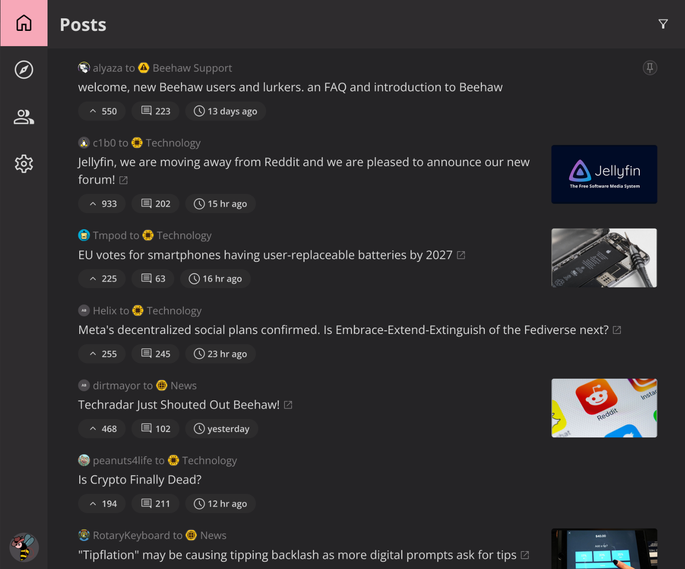

# Slemmy

  

## Status

This project is currently not usable for production. It will stay this way
until either issue https://github.com/LemmyNet/lemmy/issues/3109 gets addressed
or issue https://github.com/diamondburned/slemmy/issues/1 gets implemented.

## Rants

### Why Tailwind?

No good reason. Initially I wanted to try out a seemingly-good CSS framework.
It turned out to be awful, and so did Tailwind.

My advice? Never use Tailwind. It's a waste of time.
